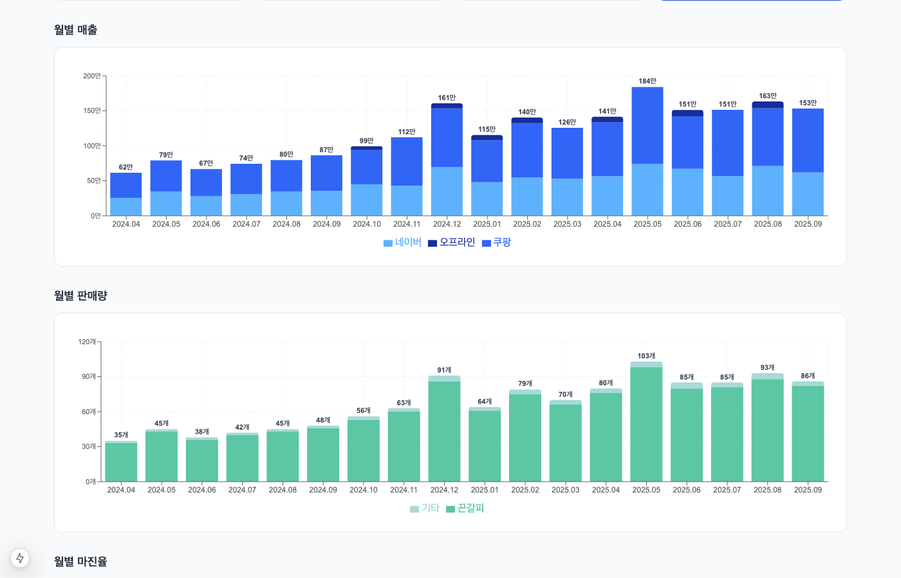
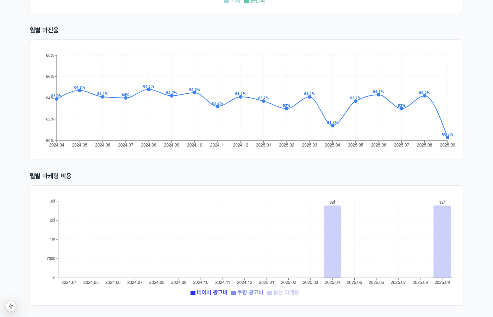
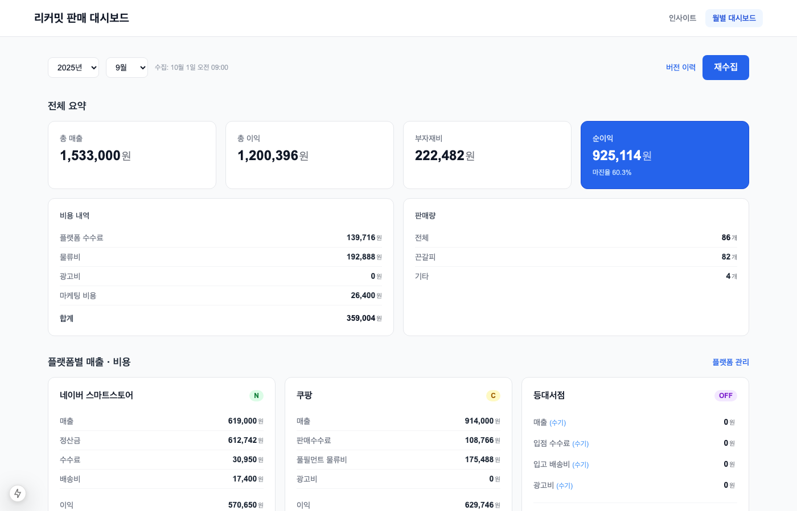
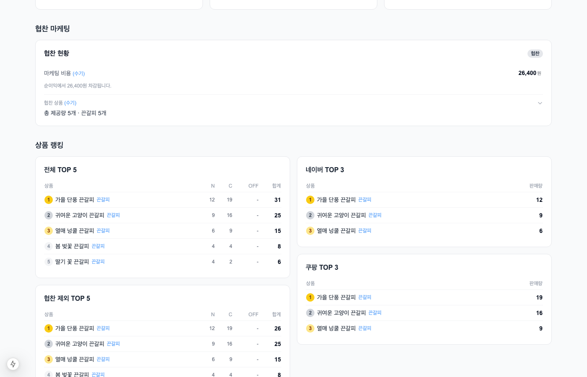
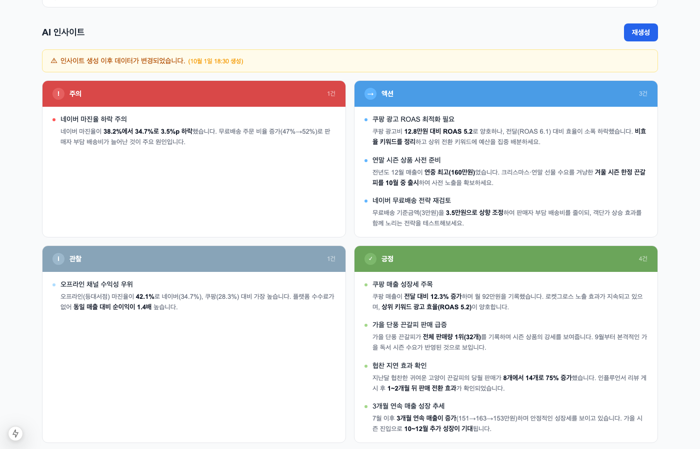
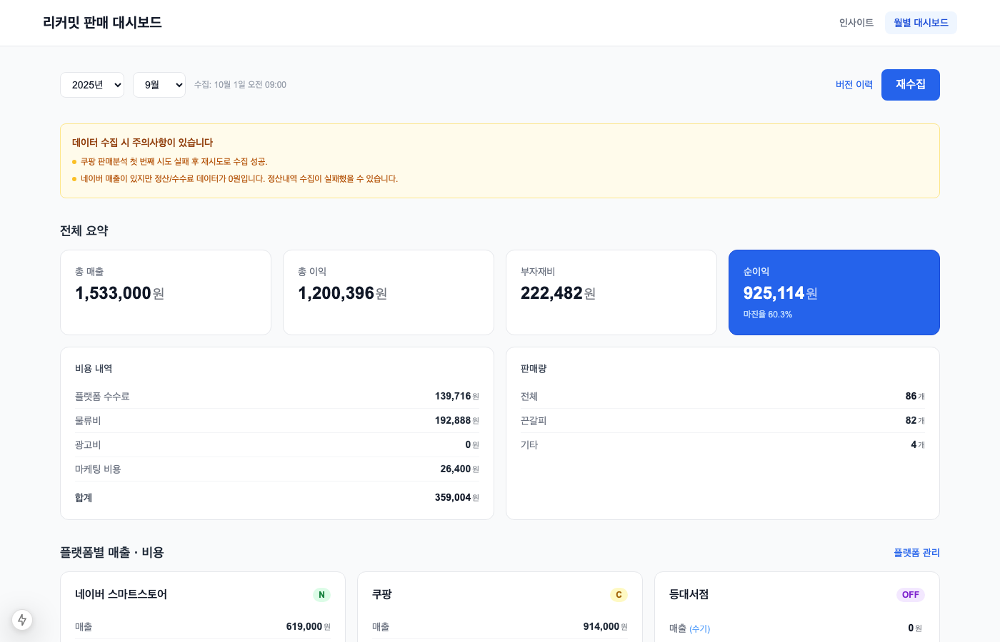

# 멀티플랫폼 매출 분석 자동화 대시보드

1인 핸드메이드 브랜드의 **네이버 스마트스토어 · 쿠팡 · 오프라인** 판매 데이터를 자동 수집하고, AI가 종합 분석하여 월간 비즈니스 인사이트를 생성하는 풀스택 웹 애플리케이션입니다.

매달 2~3시간 소요되던 수동 분석 업무를 **버튼 한 번**으로 자동화했습니다.


<br>

## 목차

- [주요 기능](#-주요-기능)
- [스크린샷](#-스크린샷)
- [기술 스택](#-기술-스택)
- [아키텍처 & 설계 결정](#-아키텍처--설계-결정)
- [AI 인사이트 엔진](#-ai-인사이트-엔진)
- [코드 컨벤션 & 품질 관리](#-코드-컨벤션--품질-관리)
- [데이터 수집 & 에러 처리 UX](#-데이터-수집--에러-처리-ux)
- [설치 및 실행](#-설치-및-실행)
- [데이터 구조 & 보안](#-데이터-구조--보안)

<br>

## 🧩 주요 기능

| 기능 | 설명 |
|------|------|
| **자동 데이터 수집** | Playwright 브라우저 자동화로 네이버·쿠팡 매출·정산·주문 데이터 스크래핑 |
| **이기종 데이터 통합** | 3개 플랫폼의 상이한 데이터 구조를 통합 스키마로 정규화 |
| **AI 인사이트 생성** | Groq API(Llama 3.3 70B) 기반 8개 카테고리 비즈니스 인사이트 자동 분석 |
| **누적 트렌드 차트** | 월별 매출·판매량·마진율·마케팅 비용 4종 차트 (Recharts) |
| **상품 랭킹 & 매트릭스** | 전체·플랫폼별 TOP5 랭킹, 상품 × 채널 수량 교차표 |
| **협찬 마케팅 추적** | 협찬 수량·비용 입력 및 1~2개월 뒤 지연 효과 분석 |
| **수기 편집 & 재계산** | 수집 오류 시 직접 수정 → 이익·랭킹·매트릭스 즉시 재계산 |
| **버전 이력 관리** | 데이터 수정 시 자동 백업 (최대 5개 버전 복구 가능) |

<br>

## 📸 스크린샷

### 인사이트 — 월별 매출 & 판매량 추이

플랫폼별 스택 매출 차트(네이버·쿠팡·오프라인)와 끈갈피/기타 판매량 차트를 한 화면에서 확인합니다.



### 인사이트 — 마진율 & 마케팅 비용

월별 마진율 추이 라인 차트와 플랫폼별 광고비 + 협찬 마케팅 비용 스택 차트입니다.



### 월별 대시보드 — 전체 요약 & 플랫폼별 매출·비용

총 매출, 이익, 부자재비, 순이익 요약 카드와 네이버·쿠팡·오프라인 각 채널의 상세 비용 구조를 보여줍니다.



### 협찬 마케팅 & 상품 랭킹

협찬 현황 카드와 전체 TOP5, 협찬 제외 TOP5, 플랫폼별 TOP3 랭킹을 한눈에 비교합니다.



### AI 인사이트 카드

Groq AI가 생성한 **주의·액션·관찰·긍정** 4가지 타입의 인사이트 카드. 인사이트 생성 이후 데이터가 변경되면 낡음 경고 배너가 자동으로 표시됩니다.



### 데이터 수집 오류 배너

스크래핑 중 일부 항목 수집 실패 시, 구체적인 오류 내용을 배너로 안내하여 데이터 신뢰성을 투명하게 전달합니다.



<br>

## 🛠 기술 스택

| 영역 | 기술 | 선택 이유 |
|------|------|-----------|
| **Framework** | Next.js 15 (App Router) | 서버 컴포넌트 + API Routes로 풀스택 단일 프로젝트 구성 |
| **Language** | TypeScript (strict) | 도메인 모델의 타입 안전성 확보 |
| **Styling** | Tailwind CSS | 빠른 UI 프로토타이핑, 컴포넌트별 스타일 응집 |
| **Charts** | Recharts | React 네이티브 차트, 커스텀 자유도 |
| **Scraping** | Playwright | SPA iframe·동적 캘린더 등 복잡한 DOM 대응 |
| **AI** | Groq API (Llama 3.3 70B) | 무료 티어로 빠른 추론, 한국어 인사이트 생성 |
| **Testing** | Vitest | TypeScript + ESM + path alias 네이티브 지원 |
| **Storage** | 파일 기반 JSON | 1인 로컬 도구 — DB 설치 없이 즉시 사용 가능 |
| **Dev Tool** | Claude Code | AI pair programming으로 설계~구현 가속 |

### Vitest 선택 근거

Jest도 ESM을 지원하지만 아직 실험적 단계(`--experimental-vm-modules` 플래그 필요)이고, `ts-jest`나 Babel 같은 트랜스파일러 설정이 추가로 필요합니다. 이 프로젝트는 **TypeScript + ESM + path alias(`@/`)** 기반이라 이 세 가지를 별도 설정 없이 네이티브로 지원하는 Vitest가 자연스러운 선택이었습니다. React 컴포넌트 렌더링 테스트에는 Jest 쪽 레퍼런스가 더 많고, 기존에 Jest를 쓰던 프로젝트라면 Jest를 유지하는 것이 합리적이지만, 순수 로직 테스트 위주의 신규 프로젝트에서는 Vitest가 설정 부담이 적습니다.

<br>

## 🏗 아키텍처 & 설계 결정

### Data Integration — 이기종 플랫폼 데이터 통합

네이버·쿠팡·오프라인 3개 채널은 각각 **상이한 비용 구조와 상품명 체계**를 가지고 있습니다.

```
네이버: 수수료 + 판매자부담 배송비 (유료/무료배송 분리)
쿠팡:   수수료 + 풀필먼트 물류비 + 광고비
오프라인: 입점 수수료 + 택배 물류비
```

이를 **통합 이익 계산 함수 `calcPlatformProfit()`** 하나로 추상화하여, 플랫폼이 추가되어도 동일한 인터페이스로 계산합니다.

상품명 정규화(Normalization)도 핵심 과제였습니다. 네이버와 쿠팡에서 동일 상품이 전혀 다른 이름으로 등록되어 있어, **Jaccard 유사도 기반 키워드 매칭**으로 canonical 상품명을 자동 매핑합니다.

### Visualization — 데이터 시각화

4종의 Recharts 차트로 누적 트렌드를 한눈에 파악할 수 있습니다:

| 차트 | 시각화 내용 | 의사결정 지원 |
|------|-----------|-------------|
| **월별 매출** | 플랫폼별 스택 바 차트 | 채널별 매출 비중 변화 확인 |
| **월별 판매량** | 끈갈피/기타 스택 바 차트 | 주력 상품 비율 추적 |
| **월별 마진율** | 라인 차트 + 손익분기 기준선 | 수익성 추세 모니터링 |
| **월별 마케팅 비용** | 광고비+협찬비 스택 바 차트 | 마케팅 ROI 추적 |

### 데이터 저장 전략

**DB 없이 JSON 파일(`data/reports/YYYY-MM.json`)**로 저장합니다. 1인 운영 로컬 도구이므로 DB 설치 복잡도를 제거하고, 파일 하나에 해당 월의 모든 데이터(매출·비용·랭킹·인사이트)를 self-contained로 담아 백업·이동이 간편합니다.

- **쓰기 잠금(write lock)**: 동시 PATCH 요청으로 인한 JSON 손상 방지
- **버전 백업**: 수정 시 자동으로 `.v{timestamp}.json` 백업 생성 (최대 5개 유지)
- **마이그레이션**: 스키마 변경 시 `loadReport()`에서 자동 변환 (예: 단일 오프라인 → 다중 입점처 배열)

<br>

## 🤖 AI 인사이트 엔진

수집된 월별 매출 데이터를 기반으로 비즈니스 인사이트를 생성하는 AI 레이어입니다.
단순히 API를 호출하는 것이 아니라, **안정적인 결과를 일관되게 얻기 위한 시스템**을 설계했습니다.

### 구조화된 프롬프트 설계

프롬프트를 **7개 섹션 빌더 함수**로 모듈화하여, 데이터 구조가 변경되어도 해당 빌더만 수정하면 됩니다.

```
buildPeriodSection()      → 분석 기간
buildPlatformSection()    → 플랫폼별 매출·비용·이익률·ROAS
buildSummarySection()     → 전체 요약 (총 매출·순이익·마케팅 비용)
buildProductSection()     → 상품 TOP5 랭킹 + 플랫폼 매트릭스
buildSponsorshipSection() → 협찬 마케팅 현황
buildTrendSection()       → 전달 대비 변화율 + 상품 변동 + 협찬 지연 효과
buildOverviewSection()    → 전체 기간 누적 추이 테이블 (3개월 이상)
```

시스템 프롬프트에는 사업 도메인 맥락(ROAS 기준, 협찬 지연 효과, 달력 요인 등)과 **8개 분석 카테고리**(매출/이익/상품/플랫폼/광고/협찬/추세/개요) 가이드를 포함하여, AI가 사업 맥락을 이해한 상태에서 분석하도록 합니다.

### 변화 원인 분석

매출·판매량 증감이 발생했을 때 "왜 그런지"를 유추하도록 프롬프트에 원인 후보 목록을 제공합니다:
- 광고비 변화 (중단/시작에 따른 노출 변화)
- 협찬 리뷰 효과 (1~2개월 뒤 판매 전환)
- 달력 요인 (2월은 일수 부족, 연휴 시즌 온라인 쇼핑 감소)
- 계절/시즌 요인 (연말 선물 수요, 방학 독서량 변화)

### 타입 검증 & 보충 생성 (안정성 확보)

AI 응답의 품질 편차 문제를 해결하기 위해 **"검증 후 보충"** 패턴을 적용했습니다:

```
1차 생성 → 타입 분포 검증 → 충족 시 바로 반환
                            → 미달 시 부족 타입만 2차 보충 요청 → 병합
```

- `action` 타입 최소 2개, `positive`+`negative` 합산 최소 3개를 보장
- 기존 좋은 인사이트는 보존하면서 누락된 타입만 추가 생성
- 대부분 1회 API 호출로 완료, 드물게 2회 (최대 비용 예측 가능)

### 한자 혼입 방지 (후처리 안전망)

Llama 모델이 간헐적으로 한자를 혼입하는 문제(예: `"相対적"`)에 대해:
1. 프롬프트에 **언어 규칙을 최우선 규칙으로 격상** (위반 시 전체 응답 무효)
2. 런타임 **한자→한글 치환 맵**(60개 패턴) 후처리 안전망 + 잔여 한자 자동 제거

### 인사이트 낡음 감지 UX

인사이트 생성 이후 데이터가 수정되면 `insightsGeneratedAt` 타임스탬프와 `lastModifiedAt`을 비교하여 **경고 배너를 자동 표시**합니다. 사용자는 재생성 버튼으로 최신 데이터 기반 인사이트를 받을 수 있습니다.

<br>

## 📏 코드 컨벤션 & 품질 관리

[CONVENTIONS.md](CONVENTIONS.md)에 정의된 규칙을 기반으로 개발하며, 3~5인 팀에서도 통용될 수 있는 수준의 코드 품질 기준을 유지합니다.

### 아키텍처 레이어

```
UI Layer (components/, app/page.tsx)
    ↓ calls
API Layer (app/api/*/route.ts)
    ↓ calls
Business Logic (lib/calculations/, lib/ai/)
    ↓ calls
Data Layer (lib/storage/, lib/scrapers/)
    ↓ calls
Foundation (lib/types/, lib/config.ts, lib/utils/)
```

**핵심 원칙**: 상위 레이어가 하위만 호출. `calculations/` 디렉토리는 I/O 없는 순수 함수만 허용.

### 주요 규칙

| 규칙 | 내용 |
|------|------|
| **`any` 금지** | `unknown` + 타입 가드로 대체 |
| **환경변수 중앙화** | `process.env` 직접 접근 금지, `lib/config.ts`에서만 관리 |
| **에러 처리 통일** | `getErrorMessage(error, "기본 메시지")` 유틸 함수 사용 |
| **매직 넘버 금지** | 모든 상수는 `config.ts` 또는 `constants.ts`에 정의 |
| **커밋 보안** | 실제 매출 금액, API 키 등 민감 데이터 커밋 메시지/PR 포함 절대 금지 |

### 테스트 커버리지

```bash
npx vitest run   # 130개 테스트, 7개 테스트 파일
```

| 테스트 파일 | 대상 | 테스트 수 |
|------------|------|----------|
| `profit.test.ts` | 이익 계산, 배송비 보정, 부자재비 | 29 |
| `ranking.test.ts` | 플랫폼별/전체 랭킹, 매트릭스 | 22 |
| `product.test.ts` | 상품 분류, 정규화, 유사도 매칭 | 36 |
| `overview.test.ts` | 월별 개요 집계 | 13 |
| `deep-merge.test.ts` | 중첩 객체 부분 업데이트 | 16 |
| `format.test.ts` | 통화 포맷, 날짜 유틸 | 7 |
| `sanitize.test.ts` | 한자→한글 치환, CJK 제거 | 7 |

### 새 기능 추가 순서

```
타입 정의 → 순수 함수 → 테스트 → 저장소/API → UI → tsc + vitest → 커밋
```

<br>

## 🛡 데이터 수집 & 에러 처리 UX

### 멀티플랫폼 스크래핑

Playwright 기반 스크레이퍼를 **5개 모듈**로 분리 설계했습니다:

| 모듈 | 수집 대상 | 해결한 기술 과제 |
|------|----------|----------------|
| `naver-orders` | 주문통합검색 → 제품별 수량 | SPA iframe 내부 탐색, TOAST UI Grid 페이지네이션 |
| `naver-sales` | 판매분석 → 총 매출 | `biz_iframe` 내부 날짜 설정 |
| `naver-settlement` | 정산내역 → 비용 항목 | 커스텀 DatePicker 대응 |
| `coupang-sales` | 판매분석 → 매출+제품별 수량 | `dp__` 커스텀 캘린더, value-before-label 패턴 |
| `coupang-settlement` | 로켓그로스 정산 → 비용 항목 | custom-selection 캘린더, 정규식 기반 비용 파싱 |

### 안정성 확보

- **자동 재시도 래퍼(`withRetry`)**: 네트워크 지연·DOM 로딩 실패 시 최대 3회 재시도
- **세션 기반 로그인 유지**: `.browser-session/`에 쿠키 저장, 세션 만료 전까지 재사용
- **데이터 정합성 검증**: 수집 후 매출/수량 0인 항목 감지하여 경고 생성

### 수집 오류 UX

스크래핑 중 일부 항목 수집에 실패하면, 어떤 데이터가 누락되었는지를 **구체적인 경고 배너로 안내**합니다. 사용자는 이를 보고 해당 항목만 수기로 보정할 수 있습니다.

<br>

## 🚀 설치 및 실행

```bash
# 의존성 설치
npm install

# Playwright 브라우저 설치
npm run playwright:install

# 개발 서버 실행 (http://localhost:3000)
npm run dev
```

### 환경 변수 설정

프로젝트 루트에 `.env.local` 파일을 생성합니다.

```env
# Groq AI 인사이트 생성 (https://console.groq.com)
GROQ_API_KEY=gsk_xxxxxxxxxxxxxxxxxxxx

# 부자재비 비율 (매출 대비 %, 예: 12)
ONLINE_MATERIAL_RATE=12
OFFLINE_MATERIAL_RATE=15

# 협찬 1개당 원가 (원, 예: 4800)
REVIEW_MARKETING_COST_PER_HANDMADE=4800
```

### 데이터 수집 방법

대시보드 상단의 **"데이터 수집"** 버튼을 클릭하면 네이버·쿠팡 스크래핑과 상품 매핑 동기화가 자동으로 실행됩니다.

> 최초 실행 시 저장된 브라우저 세션(`.browser-session/`)이 필요하며, 세션이 없으면 네이버·쿠팡에 직접 로그인해야 합니다.

<br>

## 🔒 데이터 구조 & 보안

```
data/
├── reports/
│   ├── 2025-10.json      # 월별 레포트 (자동 저장)
│   ├── 2025-10.v*.json   # 버전 백업 (자동 생성, 최대 5개)
│   └── ...
├── product-mapping.json  # 상품명 매핑 테이블
└── venues.json           # 오프라인 입점처 목록
```

### 보안 설계

- **실제 데이터 격리**: `data/` 디렉토리는 `.gitignore`로 제외되어 매출·상품 데이터가 저장소에 포함되지 않습니다
- **환경변수 중앙화**: 모든 API 키·비율 설정은 `.env.local`에서만 관리하며, `lib/config.ts`를 통해서만 접근합니다
- **커밋 보안 규칙**: 커밋 메시지·PR에 실제 매출 금액, API 키 등 민감 데이터 포함을 금지하는 컨벤션을 운영합니다
- **스크린샷 데이터**: README의 모든 스크린샷은 실제 데이터가 아닌 mock 데이터로 생성되었습니다
