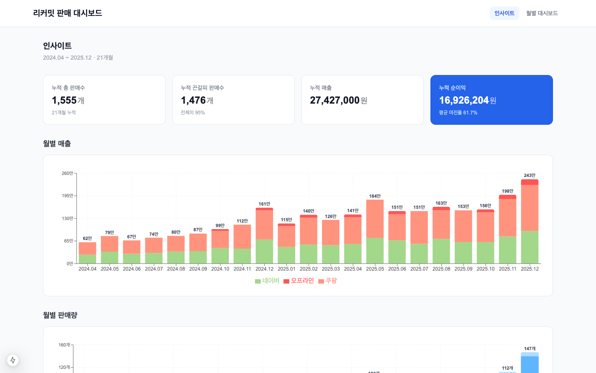
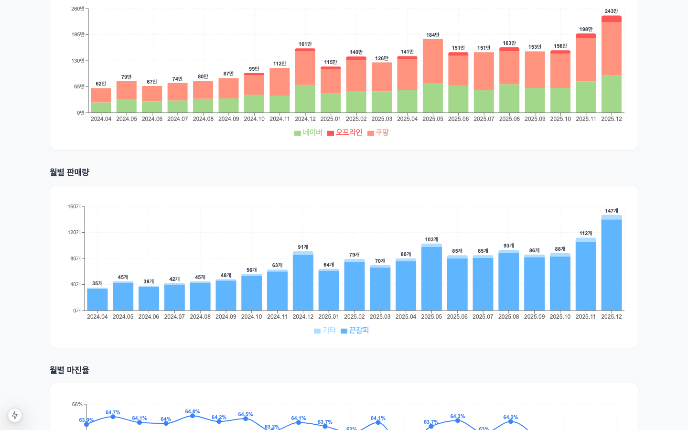
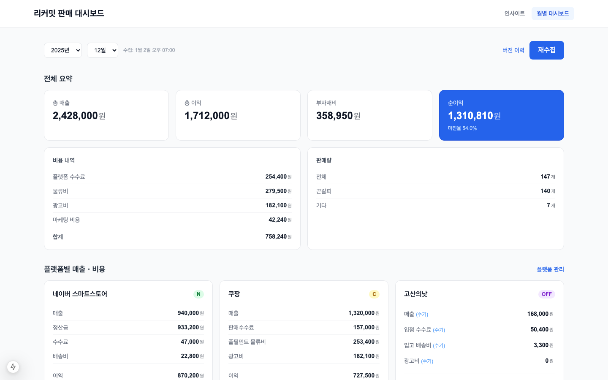
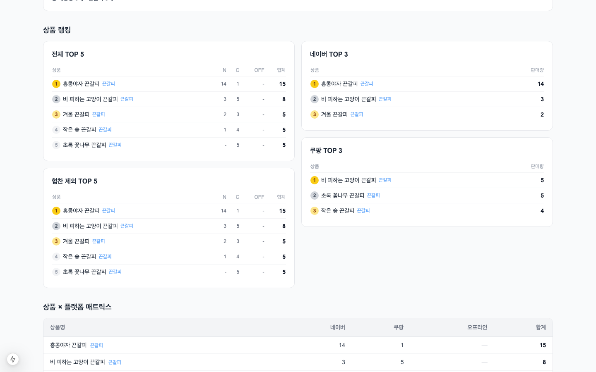
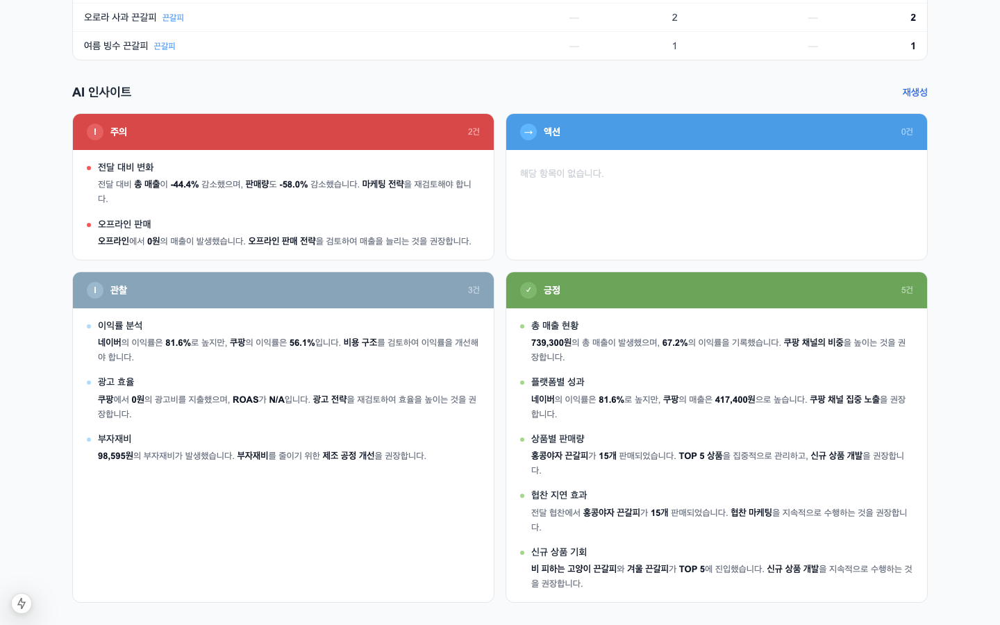

# 쿠팡, 스마트스토어 매출 분석 자동화 대시보드

1인 핸드메이드 브랜드 운영 중 매달 2~3시간씩 수동으로 수행하던 멀티플랫폼(쿠팡·네이버) 판매 분석 업무를 자동화한 풀스택 웹 애플리케이션입니다. Playwright 기반 스크레이퍼가 네이버 스마트스토어와 쿠팡의 매출·정산·주문 데이터를 자동 수집하고, 오프라인 입점처 매출은 수기 입력한 뒤, AI(Groq API)가 전체 데이터를 종합 분석해 월간 판매 인사이트를 생성합니다.



---

## 주요 기능

| 기능 | 설명 |
|------|------|
| **자동 데이터 수집** | Playwright로 네이버·쿠팡 판매 페이지를 브라우저 자동화로 스크래핑 |
| **다중 채널 통합** | 네이버 스마트스토어 / 쿠팡 로켓그로스 / 오프라인 입점처 통합 관리 |
| **AI 인사이트 생성** | Groq API(Llama 3.3 70B)로 매출·이익·광고·협찬 인사이트 자동 작성 |
| **월별 상세 대시보드** | 플랫폼별 매출·수수료·물류비·이익률 한눈에 확인 |
| **누적 트렌드 차트** | 월별 매출 추이·판매량·마진율 차트 (Recharts) |
| **상품 랭킹 & 매트릭스** | 전체·플랫폼별 판매 TOP3, 상품 × 채널 수량 교차표 |
| **협찬 마케팅 추적** | 협찬 수량·비용 입력 및 다음 달 지연 효과 분석 |
| **버전 이력 관리** | 데이터 수정 시 자동 백업 (최대 5개 버전 복구 가능) |
| **수기 편집** | 수집 오류 발생 시 수량·비용 직접 수정, 즉시 이익 재계산 |

---

## 스크린샷

### 인사이트 — 누적 트렌드
월별 매출(플랫폼 스택), 판매량, 마진율 차트를 한 페이지에서 확인합니다.



### 월별 대시보드 — 플랫폼별 매출 & 비용 상세
네이버·쿠팡·오프라인 각 채널의 매출, 수수료, 물류비, 광고비, 순이익을 집계합니다.



### 상품 랭킹 & 플랫폼 매트릭스
전체·플랫폼별 TOP5 랭킹과 상품 × 채널 수량 교차표를 확인합니다.



### AI 인사이트
Groq AI가 생성한 긍정·주의·관찰·액션 카테고리별 인사이트 카드.



---

## 기술 스택

- **Framework**: Next.js 15 (App Router, Server Components)
- **Language**: TypeScript
- **Styling**: Tailwind CSS
- **Charts**: Recharts
- **Scraping**: Playwright (Chromium headless)
- **AI**: Groq API — `llama-3.3-70b-versatile`
- **Storage**: 파일 기반 JSON (DB 불필요, `data/reports/YYYY-MM.json`)
- **개발 도구**: Claude Code (AI pair programming), Playwright MCP

---

## 개발 배경

핸드메이드 끈갈피(비즈 책갈피)를 네이버 스마트스토어와 쿠팡에서 판매하면서, 매월 판매 데이터를 각 플랫폼에서 수동으로 정리하고 인사이트를 추출하는 작업에 2~3시간이 소요되었습니다.

**Claude Code**를 활용한 AI pair programming으로 타입 시스템 설계부터 스크레이퍼, 비즈니스 로직, API, 대시보드 UI까지 **4일 만에** 설계·구축했습니다.

---

## 기술적 구현 포인트

### 1. 멀티플랫폼 데이터 수집 자동화

Playwright 기반 스크레이퍼를 플랫폼·페이지별 **5개 모듈**로 분리 설계했습니다 (네이버 주문/판매분석/정산, 쿠팡 판매분석/정산). SPA iframe 내부 콘텐츠 탐색, react-datepicker 커스텀 헤더 대응, 세션 기반 로그인 유지 등 실전 문제를 해결하고, 자동 재시도 래퍼(`withRetry`) 및 데이터 정합성 검증 로직으로 수집 안정성을 확보했습니다.

### 2. 도메인 특화 비즈니스 로직 설계

플랫폼별 상이한 비용 구조(네이버 배송비 보정, 쿠팡 마크업, 오프라인 수수료)를 통합 이익 계산 함수로 추상화했습니다. 네이버↔쿠팡↔오프라인 간 동일 상품의 다른 상품명을 키워드 유사도 매칭으로 정규화(canonical mapping)하고, 협찬 비용 자동 산정·협찬 제외 실판매 랭킹 등 사업 운영 관점의 요구사항을 TypeScript 타입 체계로 모델링했습니다.

### 3. AI 인사이트 엔진 — 구조화된 프롬프트 설계

사업 도메인 맥락(판매 채널, 광고 효율 기준, 협찬 지연 효과 등)을 체계적으로 전달하는 시스템 프롬프트를 설계했습니다. 5개 섹션 빌더로 프롬프트를 모듈화하고, 당월 + 최대 3개월 히스토리를 구조화된 형태로 전달해 **7개 분석 카테고리**(매출/이익/상품/플랫폼/광고/협찬/추세)에서 수치 기반 인사이트를 생성합니다.

### 4. 대시보드 UI 및 코드 품질

다중 오프라인 입점처 동적 관리(입점처 레지스트리 + 모달 UI)와 인라인 수기 편집 → 서버 재계산 실시간 반영을 구현했습니다. 공통 컴포넌트 추출, 계산 로직 3파일 분리, `updateReport()` 130줄→30줄 분해 등 체계적인 리팩토링을 병행했습니다.

---

## 설치 및 실행

```bash
# 의존성 설치
npm install

# Playwright 브라우저 설치
npm run playwright:install

# 개발 서버 실행 (http://localhost:3000)
npm run dev
```

### 환경 변수 설정

프로젝트 루트에 `.env.local` 파일을 생성합니다.

```env
# Groq AI 인사이트 생성 (https://console.groq.com)
GROQ_API_KEY=gsk_xxxxxxxxxxxxxxxxxxxx

# 부자재비 비율 (매출 대비 %, 예: 12)
MATERIAL_COST_RATE=12

# 협찬 1개당 원가 (원, 예: 4800)
REVIEW_MARKETING_COST_PER_HANDMADE=4800
```

---

## 데이터 수집 방법

대시보드 상단의 **"데이터 수집"** 버튼을 클릭하면 네이버·쿠팡 스크래핑과 상품 매핑 동기화가 자동으로 실행됩니다.

> 최초 실행 시에는 저장된 브라우저 세션(`.browser-session/`)이 필요하며, 세션이 없을 경우 네이버·쿠팡에 직접 로그인이 필요합니다.
> 신규 상품이 추가된 경우, 수집 후 `data/product-mapping.json`에서 canonical 이름을 확인할 수 있습니다.

### 상품 매핑 설정

네이버와 쿠팡에서 동일 상품의 상품명이 다를 경우 `product-mapping.json`으로 통합 집계합니다.
`product-mapping.example.json`을 참고해 직접 작성할 수도 있습니다.

---

## 데이터 구조

```
data/
├── reports/
│   ├── 2025-10.json      # 월별 레포트 (자동 저장)
│   ├── 2025-10.v*.json   # 버전 백업 (자동 생성, 최대 5개)
│   └── ...
├── product-mapping.json  # 상품명 매핑 테이블
└── venues.json           # 오프라인 입점처 목록
```

월별 레포트 하나에 네이버·쿠팡·오프라인 판매 데이터, 이익 계산, 랭킹, AI 인사이트가 모두 포함됩니다.

---

## 주요 설계 결정

- **DB 없이 JSON 파일로 저장**: 혼자 쓰는 로컬 도구이므로 설치 복잡도를 최소화했습니다.
- **Server Component + 파일 I/O**: API 레이어 없이 서버에서 직접 JSON을 읽어 렌더링합니다.
- **쓰기 잠금(write lock)**: 동시 PATCH 요청으로 인한 JSON 손상을 방지합니다.
- **Playwright 재시도 로직**: 플랫폼 응답 지연 시 자동 재시도로 수집 안정성을 높였습니다.
